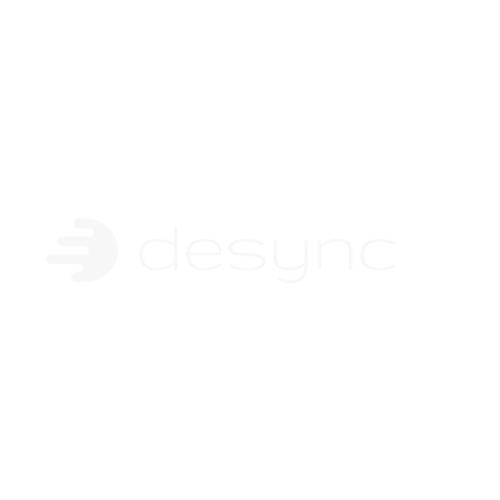

  

<h1 align="center">Desync CRM</h1>

The self-hosted CRM behind the Desync AI platform.

  <a href="https://www.desync.ai">Website</a>

 

## About

Desync CRM is the customer-relationship system that powers [Desync&nbsp;AI](https://www.desync.ai). It gives our team and customers a fast, extensible CRM — objects, views, workflows, and native AI — wired into the Desync lead-generation platform, Google Calendar, and integrations such as HubSpot and Salesforce.

Authentication is handled through Clerk, and workspace access is gated by Desync's billing entitlements, so the CRM is part of one product rather than a bolt-on.

## Stack

- **Frontend:** React + TypeScript
- **Backend:** NestJS (Node) + PostgreSQL + Redis
- **Auth:** Clerk
- **Deploy:** Docker image on Render

## Development

This is a Yarn monorepo. Install dependencies with `yarn`, then use the package scripts in `packages/twenty-server` and `packages/twenty-front` to run the server and frontend locally. A Postgres and Redis instance are required (see the Docker setup under `packages/twenty-docker`).

## Attribution & license

Desync CRM is built on [Twenty](https://twenty.com), an open-source CRM, and remains distributed under the **GNU Affero General Public License v3.0**. The full license and its qualifications are in [LICENSE](./LICENSE); upstream copyright notices are retained in the source.
